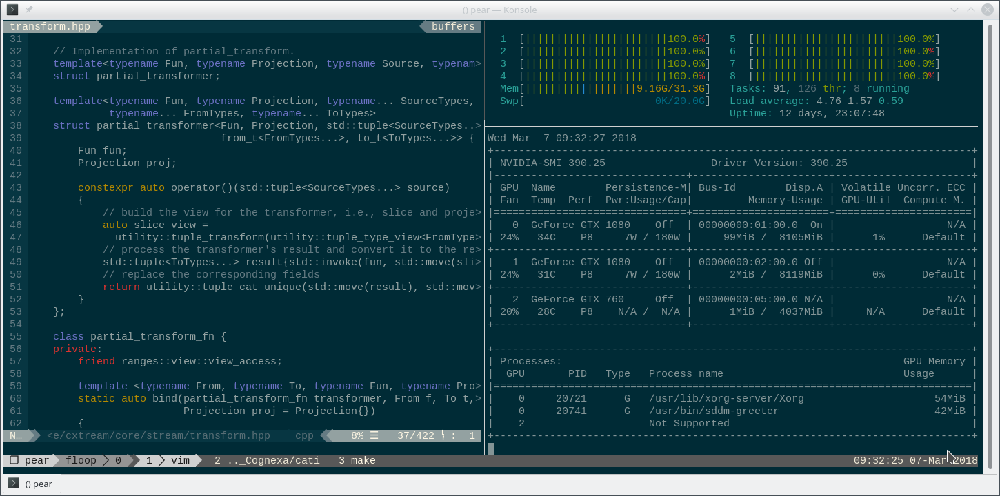

# Floop's Linux Environment

Are you tired of configuring your linux environment every time you launch a new VPS or reinstall your workstation?
Deploy Floop's environment and enjoy!



## Deployment

```
git clone https://github.com/FloopCZ/linux-environment.git
cd linux-environment
./deploy.sh --install
```

If you are a Vim user, don't forget to run `:PlugInstall` inside
Vim.

## Cheatsheet

__tmux__

| Shortcut         | Description                            |
| ---------------- | -------------------------------        |
| `Ctrl + b + c`   | Create new window.                     |
| `Ctrl + b + %`   | Split window horizontally.             |
| `Ctrl + b + _`   | Split window vertically.               |
| `Ctrl + b + x`   | Kill frozen pane.                      |
| `Alt + h/l`      | Move one window left/right.            |
| `Ctrl + h/j/k/l` | Move one pane left/down/up/right.      |

__vim__

| Shortcut         | Description                            |
| ---------------- | -------------------------------        |
| `:tabe <name>`   | Open existing/new file in a new tab.   |
| `Shift + h/l`    | Move one tab left/right.               |
| `:PlugInstall`   | Install all the registered plugins.    |

__zsh__

| Shortcut              | Description                               |
| --------------------- | ----------------------------------------- |
| `Ctrl + space`        | Execute the suggested command.            |
| `Ctrl + right arrrow` | Accept one word of the suggested command. |
